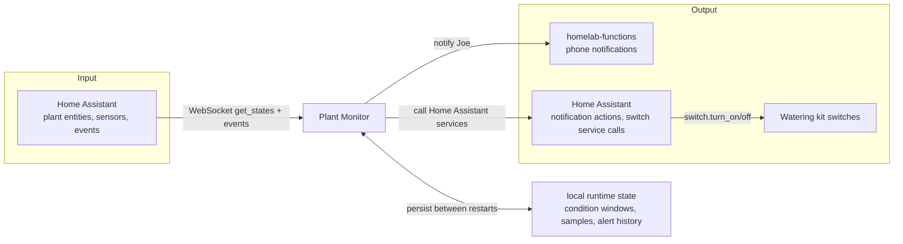
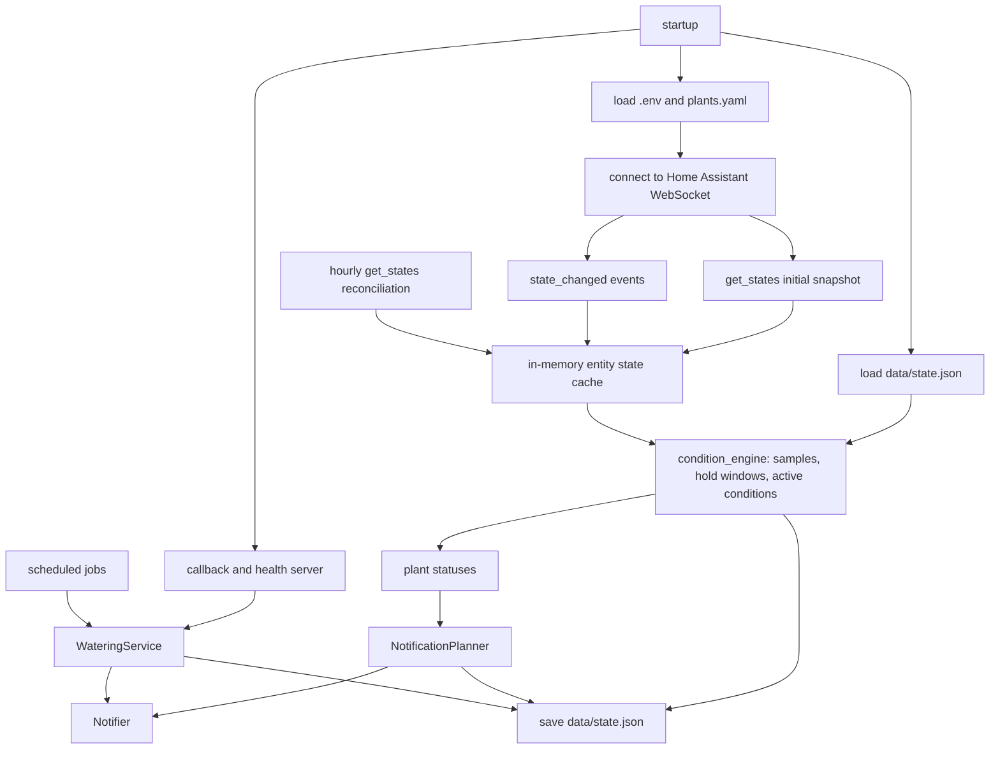

# Architecture

Plant Monitor is a long-running Home Assistant-backed service.

## System Context

Plant Monitor is the domain service. Home Assistant remains the source of
truth for current entity state and device actions. `homelab-functions` is only
the shared notification path. The local runtime state file is not a database; it
is a small persisted state file so condition windows, recent samples, alert
history, snoozes, and watering lookbacks survive restarts.

## Runtime Data Flow

The monitor updates the cache from live Home Assistant events and also refreshes
it with periodic reconciliation so missed events do not permanently stale the
local view. The condition engine owns rule state; the planner decides whether an
active condition should notify now.

## Components

- `plant_monitor/cli.py`: `plant discover`, `plant status`, `plant monitor`.
- `plant_monitor/config.py`: `.env` and `plants.yaml` loading.
- `plant_monitor/discovery.py`: live Home Assistant discovery.
- `plant_monitor/ha.py`: Home Assistant WebSocket adapter.
- `plant_monitor/monitor.py`: orchestration, reconnects, loops, event handling.
- `plant_monitor/condition_engine.py`: samples, hold windows, condition lifecycle.
- `plant_monitor/policy.py`: shared threshold and sensor helpers.
- `plant_monitor/thresholds.py`: species defaults.
- `plant_monitor/notification_planner.py`: decides which active conditions should notify now.
- `plant_monitor/notify.py`: digest and phone notification formatting/sending.
- `plant_monitor/watering.py`: watering guard, pump execution, watering lookbacks.
- `plant_monitor/web.py`: health and callback server.
- `plant_monitor/runtime_state.py`: persisted `data/state.json`.

## Alert Model

Phone alerts are intentionally quiet:

- Raw readings create condition candidates immediately.
- Candidates become active only after their hold window passes.
- Missing or `unavailable` sensor states must persist for 10 minutes before
  they can trigger a phone alert, which filters Home Assistant restart noise.
- Freshness uses Home Assistant `last_reported` when available, falling back to
  `last_updated`. Battery percentage can remain unchanged for a long time, so a
  stale battery timestamp is ignored when another sensor for the same plant is
  reporting fresh data; low-battery percentage alerts still apply.
- Notifications send on activation, repeat cadence, or severity-relevant active
  conditions.
- Numeric drift inside the same active condition does not keep retriggering.
- Lower-priority observations can appear in status or weekly digest without
  becoming immediate phone alerts.

The persisted state file keeps condition records, recent samples, alert
timestamps, snoozes, watering history, and scheduled lookbacks. Restarting the
container preserves windowing as long as `data/state.json` is mounted.

## Watering

Watering is guarded:

- Watering is never automatic.
- A water button appears only when an active moisture-low condition is high
  confidence and the watering guard passes.
- Watering is blocked for stale moisture data, missing pump mapping, active pump
  cooldown, or a duration above the configured cap.
- After watering, dry alerts are suppressed briefly and wet/soggy observations
  are suppressed longer.
- The service schedules 1-hour and 4-hour lookbacks to report whether moisture
  or humidity changed after watering.

Do not restart the container while a pump is actively running. Outside an active
watering event, restart is expected to be safe.
